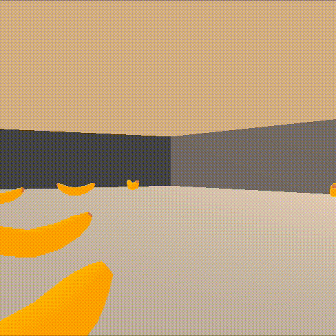

# Deep RL or how to navigate in a world full of bananas
Project to solve the Unity Banana Collector Environment using deep reinforcement learning.
The agent moves and navigates in a large, square banana world and its goal is to collect yellow bananas while avoiding blue ones. 

<p align="center">

<!--img src="pics/untrained.gif" width="300" height=250-->
</p>
  
A reward of +1 is provided for collecting a yellow banana, and a reward of -1 is provided for collecting a blue banana. Thus, the goal of your agent is to collect as many yellow bananas as possible while avoiding blue bananas.

The state space has 37 dimensions and contains the agent's velocity, along with ray-based perception of objects around the agent's forward direction. Given this information, the agent has to learn how to best select actions. Four discrete actions are available, corresponding to:

- 0 - move forward.
- 1 - move backward.
- 2 - turn left.
- 3 - turn right.

The task is episodic, and in order to solve the environment, the agent must get an average score of +13 over 100 consecutive episodes.

The project is based on [Unity ML-Agent toolkit](https://github.com/Unity-Technologies/ml-agents) and a version of the environment is available in the app folder of this repository (mac only).

# Getting Started
## Installing dependencies
The recommended way of using this repository is through Anaconda.   
Set up your banana world environment: 
```
conda create --name banana-navigation python=3.6
```

and activate it: 
```
source activate banana-navigation
```

Install dependencies:   
```
cd python/
pip install .
```

Since this repository uses jupyter notebook, install the corresponding banana-navigation kernel:
```
python -m ipykernel install --user --name drlnd --display-name "banana-navigation"
```

In jupyter notebook, before running the code, make sure that the appropriate kernel is selected.

## How to run the code
Run the `navigation.ipynb` notebook to load the environment and train your agent. 
The notebook also provides code to run the trained agent inside the banana world and see how it behaves.
