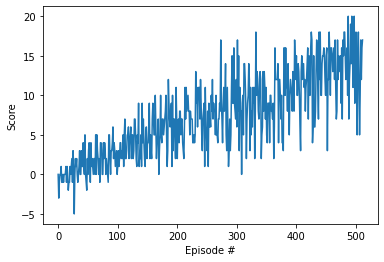

# Agent learning algorithm

The learning algorithm used is the vanilla Deep Q Learning.
Deep Q-Learning uses two separate networks with identical architectures for training. The target Q-network weigths are updated less often or more slowly than the primary Q-network.
At its core there is a simple neural network composed of three fully connected layers:

```
self.fc1 = nn.Linear(state_size, fc1_units)
self.fc2 = nn.Linear(fc1_units, fc2_units)
self.fc3 = nn.Linear(fc2_units, action_size)``
```

where state_size = 37, fc1_units = 64, fc2_units = 64 and action_size = 4.

A ReLU activation function follows each linear layer (except for the last one):
```
x = F.relu(self.fc1(state))
x = F.relu(self.fc2(x))
output = self.fc3(x)
```

Finally, the agent uses a replay buffer to break the correlation between experience tuples and improve training.

## Hyperparameters

- max_t=1000     # max time steps per episode
- eps_start=1.0
- eps_end=0.01
- eps_decay=0.995

- Replay buffer size: 100000
- Mini batch size: 64
- Discount factor gamma = 0.99
- Soft update of target network parameters Tau: 1e-3              
- Learning rate = 5e-4               
- Target network update period: 4


## Results
The environment is solved in 412 episodes, with an average score of 13.02 over 100 episodes.

Episode 100	Average Score: 1.20  
Episode 200	Average Score: 4.81  
Episode 300	Average Score: 7.42  
Episode 400	Average Score: 9.42  
Episode 500	Average Score: 12.83  
Episode 512	Average Score: 13.02  
Environment solved in 412 episodes!	Average Score: 13.02

The image below shows the score as a function of the episodes:




# Future work
Implementing a double DQN, a dueling DQN, and/or prioritized experience replay can improve stability and hence make it possible to train with less episodes.
Not much hyperparameter tuning has been done. There is certainly some work that can be done here to improve it.
Finally, the same environment could be solved from raw pixels. In this case, while the main agent architecture might remain similar to what is proposed here, the function approximation would benefit from using convolutional layers.
